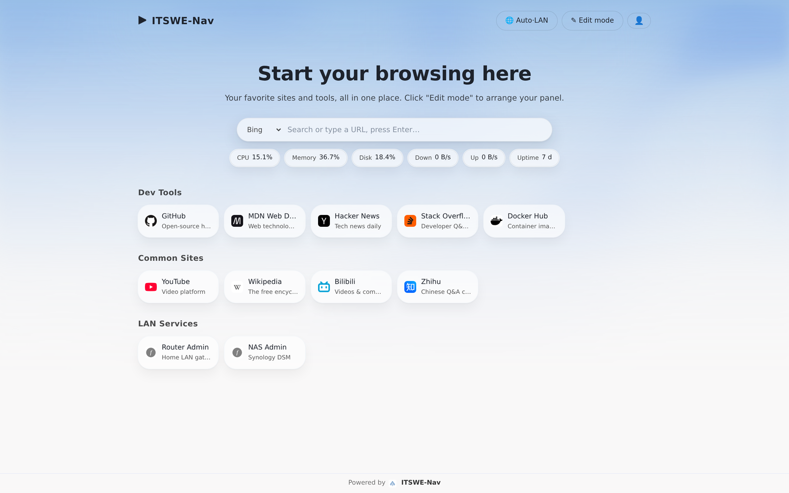
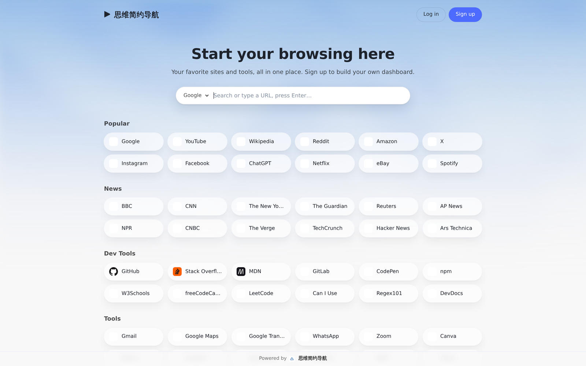
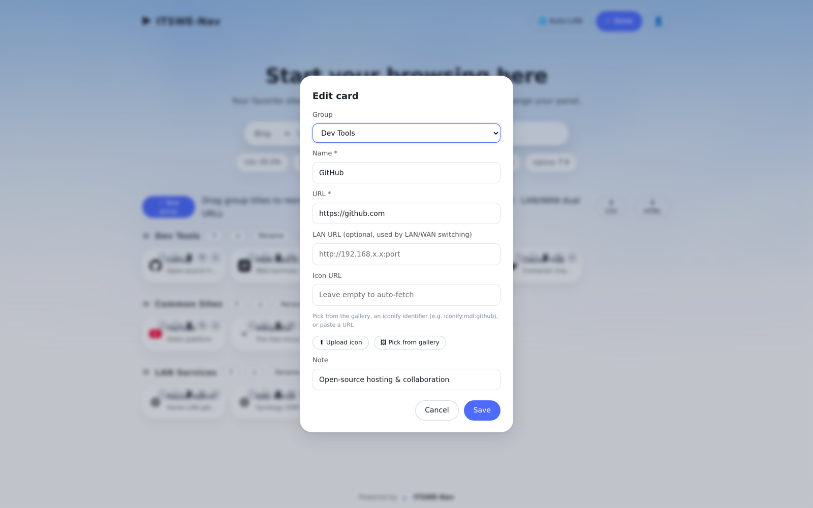
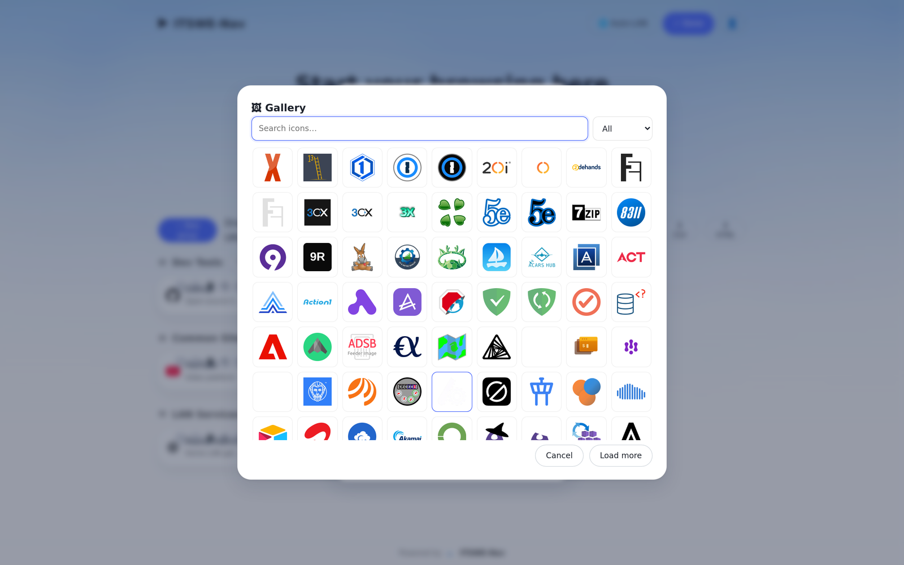
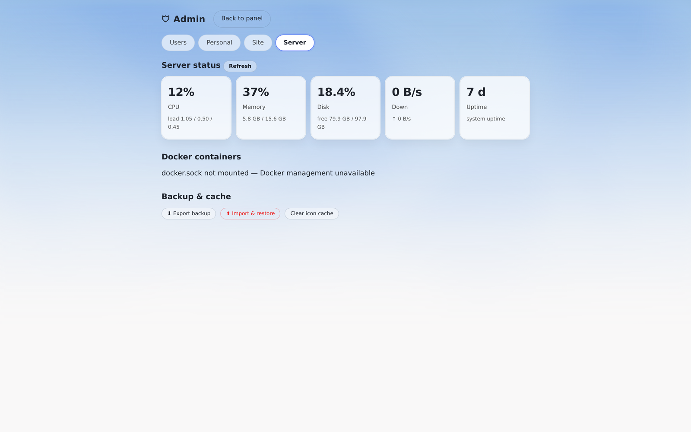
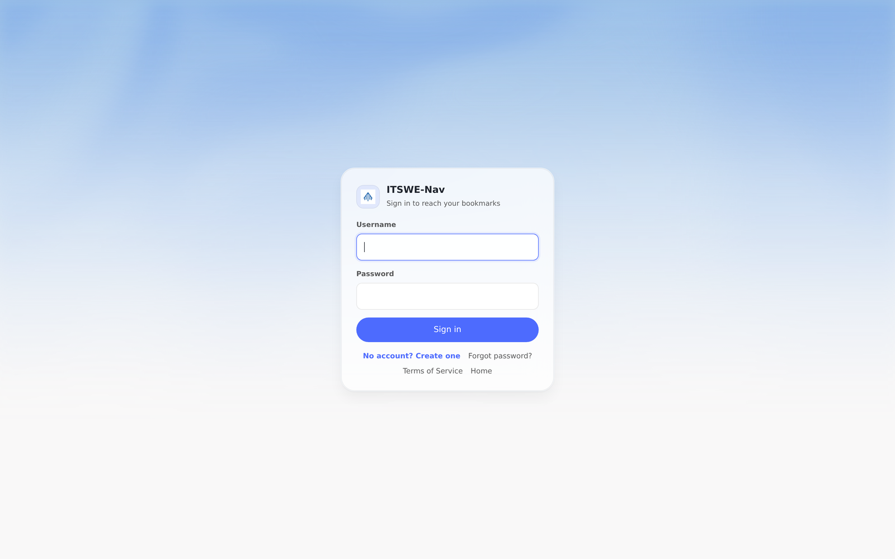
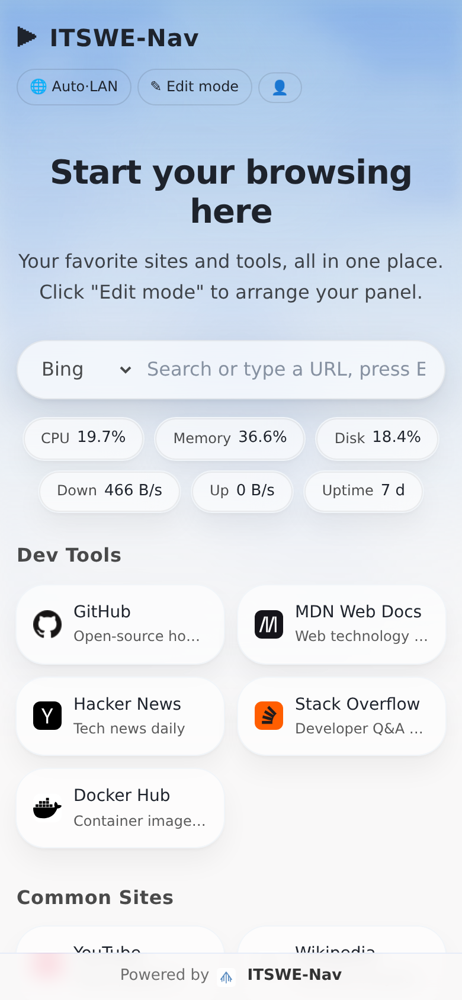

<div align="center">

# ITSWE-Nav

**A lightweight, self-hosted start page & bookmark dashboard (homepage) for homes and small teams: grouped cards · LAN/WAN dual addresses · server monitoring · Docker management**

Single-container deployment · SQLite storage · no external database · zero third-party **PHP/Composer** dependencies (vanilla PHP, no framework, no build step)

[Author's running instance](https://nav.itswe.com) · [Quick start](#-quick-start) · [中文说明](README.zh.md) · [Discord](https://discord.gg/c2EyDFqPgR) · [Telegram](https://t.me/itswenav)




</div>

## Why another start page?

Most start pages are either bloated or single-user. ITSWE-Nav targets **self-hosted homes and small teams**: one container and you're done — SQLite instead of a database server, vanilla PHP with zero dependencies. The signature feature, **dual-address cards (WAN + LAN) with one-click switching**, is designed for the classic self-hosting scenario: you are outside, your NAS is inside.

## ✨ Features

- **Multi-user**: a built-in admin (admin / itswe) is created automatically on first visit — change that password right away; registered users are regular users (if every admin is deleted, the next registration takes over for recovery); role separation, create/reset/disable/delete accounts, dedicated sign-up page with optional e-mail, terms of service, e-mail verification codes for password recovery
- **Groups & cards**: unlimited groups, notes, drag-and-drop sorting / cross-group moves / keyboard ↑↓ nudging; long-press to edit on mobile
- **LAN/WAN switching**: every card can hold both a WAN and a LAN URL; the 🌐 button toggles Auto / LAN / WAN **without a page reload**; Auto mode matches the client IP against site-wide CIDR ranges and honours `X-Forwarded-For` behind reverse proxies
- **Server monitoring**: CPU, memory, disk, network throughput, load, uptime; a status strip on the panel polls every 30 s
- **Docker management**: container list, state, port mappings, start/stop/restart (optional `docker.sock` mount)
- **Icon gallery**: 4300+ [Dashboard Icons](https://github.com/homarr-labs/dashboard-icons) and 3400+ [Simple Icons](https://github.com/simple-icons/simple-icons) served locally, searchable from the card editor
- **Layered icon fallback**: server-side proxied favicon → upload → gallery → `iconify:` identifier → initial letter
- **Guest homepage**: recommended sites + search for anonymous visitors (separate sets for Chinese and English), with a sign-up hint
- **Bilingual UI**: 中文 / English, browser-detected by default, overridable with `?lang=en|zh`
- **Appearance**: 6 gradient wallpapers, wallpaper via URL or upload (≤ 8 MB); dark mode follows the system
- **Data ownership**: full JSON backup export/import, card export to CSV / Netscape HTML, in-app iframe preview
- **Security**: CSRF protection everywhere, bcrypt hashes, login rate limiting, upload MIME sniffing + random file names, automatic incremental migrations (safe upgrades, rollback-friendly)

## 📸 Screenshots

| Guest homepage | Card editor |
|---|---|
|  |  |

| Icon gallery | Server monitor |
|---|---|
|  |  |

| Login page | Mobile |
|---|---|
|  |  |

## 🚀 Quick start

### Option A: pull the image (recommended)

```bash
mkdir itswe-nav && cd itswe-nav
curl -fsSLO https://raw.githubusercontent.com/showhoo/itswe-nav/main/docker-compose.yml
docker compose up -d
```

> The bundled compose file builds from source. To run the prebuilt image, replace the
> `build: .` / `image:` lines with `image: ghcr.io/showhoo/itswe-nav:v1.0.0-beta` (available once released).

### Option B: build from source

```bash
git clone https://github.com/showhoo/itswe-nav.git
cd itswe-nav
docker compose up -d
```

Open `http://localhost:8080` and sign in as **admin / itswe** — **change the password immediately**. Registration is **off by default** — to let other members sign up, an admin enables it in Admin panel → Site settings → Open registration.

### Icon gallery (optional, one step)

```bash
bash sync-gallery.sh    # run in the compose directory; downloads 7700+ icons into data/gallery/
```

Everything works without it: proxied favicons, uploads and iconify identifiers are independent of the gallery — only "pick from gallery" starts out empty.

> ⚠️ The default password is weak and exists only for first login. For public deployments: change it immediately, keep registration closed unless you intend to open it, and put the panel behind a reverse proxy.
> Don't need Docker management? Remove the `docker.sock` line from the compose file.

## 📖 Documentation

| Document | Contents |
|---|---|
| [Installation](docs/install.md) | compose / plain docker / non-root / reverse proxy (nginx, Caddy) / HTTPS |
| [Configuration](docs/config.md) | every site setting, environment variables, ports and volumes |
| [User guide](docs/usage.md) | guest / member / admin walkthroughs, mobile gestures |
| [FAQ](docs/faq.md) | default password, gallery, LAN detection, SMTP, backups and more |
| [Privacy](docs/privacy.md) | where data lives and every outbound request the panel can make |

## ⚙️ Configuration at a glance

| Item | Notes |
|---|---|
| Port | `8080` by default, change `ports` in compose |
| Data | everything lives in `./data` (SQLite + uploads + caches) — **back up that folder and you're done** |
| docker.sock | enables the Docker admin tab; omit without affecting anything else |
| Language | browser-detected by default; pin to Chinese/English in admin → site settings |
| LAN ranges | defaults to `192.168.0.0/16,10.0.0.0/8,172.16.0.0/12`, editable per site |

## ⬆️ Upgrade & backup

```bash
git pull && docker compose up -d --build
```

- Schema changes apply automatically through incremental migrations on first request; migrations only add — rolling back to an older release stays compatible
- **Backups**: SQLite runs in WAL mode, so copying the database file directly may produce an inconsistent snapshot. Prefer:
  - Admin panel → Server → **Export backup** (full JSON, includes password hashes — keep it safe)
  - or `docker compose stop`, then copy the whole `data/` folder

## ❓ FAQ (excerpt)

<details>
<summary><b>Where are the monitoring / Docker features?</b></summary>
Admin panel → Server tab (admins only). The status strip is on by default. Docker management requires mounting docker.sock.
</details>

<details>
<summary><b>Auto LAN/WAN detection picks the wrong address?</b></summary>
Behind a reverse proxy the panel reads the first X-Forwarded-For IP — make sure your proxy sets it. LAN ranges are editable in site settings (comma-separated CIDRs).
</details>

<details>
<summary><b>No verification e-mail arriving?</b></summary>
Configure SMTP in site settings first (SSL/TLS/plain supported). Without SMTP, registration and password recovery still work — just without e-mail verification.
</details>

See [docs/faq.md](docs/faq.md) for more.

## 🔒 Privacy

The panel embeds **no analytics, telemetry or remote checks**. All data lives in your own `data/` folder. The only outbound requests are icon-related (favicon fetching, gallery sync) — the full list is in [docs/privacy.md](docs/privacy.md).

## ⭐ Footer credit & showcase

ITSWE-Nav is free and MIT-licensed. The **"Powered by" badge** in the footer is this project's only promotion — it sits quietly at the bottom of every page, linking to [www.itswe.com](https://www.itswe.com) by default. Keeping that little line is the most tangible way to support the project. Thank you!

- The admin UI deliberately offers **no switch** to remove or edit the credit;
- If you truly must (e.g. strict corporate intranet policies), technically you can modify `www/lib/credit.php` and the database seed — may it be a considered decision, not a drive-by deletion;
- When the credit is wiped, the admin panel shows a purely local reminder (no reporting, no functional impact).

### Showcase

Sites that keep the footer credit — PRs welcome to add yours (format: `[Site](link)` — one-line description):

- [nav.itswe.com](https://nav.itswe.com) — the author's own instance
- *(your site here)*

## 💬 Join the community

Scan the QR code to join us — questions, ideas and contributions welcome.

| Discord | Telegram |
|---|---|
| [discord.gg/c2EyDFqPgR](https://discord.gg/c2EyDFqPgR) | [t.me/itswenav](https://t.me/itswenav) |
|  |  |

## 🛠 Contributing

Issues and PRs welcome! See [CONTRIBUTING.md](CONTRIBUTING.md) for the development setup. Please run `bash run-tests-ci.sh` (55 coverage + 148 e2e + 8 migration assertions) before submitting.

## 🗺 Roadmap

- [ ] Widget cards (clock, system info)
- [ ] Partial backup restore (bookmarks only / users only)
- [ ] More languages

## 📄 License

[MIT](LICENSE) © showhoo

**Credits**: VPS sponsored by [Chuangwit](https://www.chuangwit.com); gallery icons from [Dashboard Icons](https://github.com/homarr-labs/dashboard-icons) (MIT) and [Simple Icons](https://github.com/simple-icons/simple-icons) (CC0); favicon service by [favicon.im](https://favicon.im); legacy `<dialog>` support via [dialog-polyfill](https://github.com/GoogleChrome/dialog-polyfill) (MIT).
</div>
