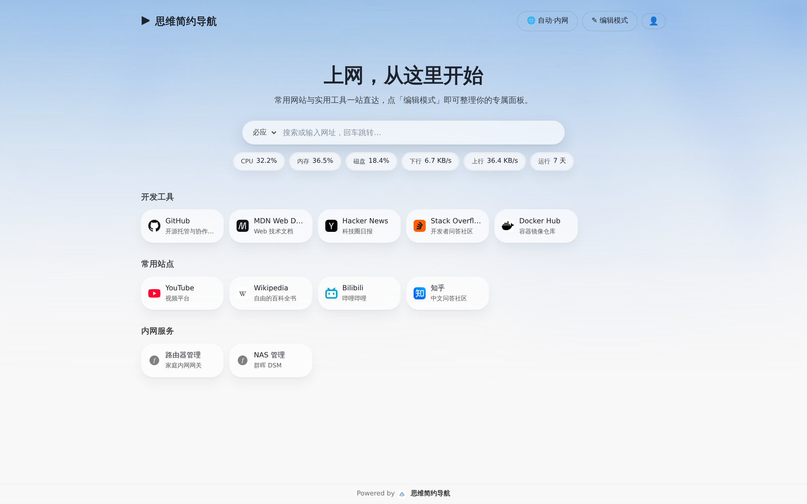
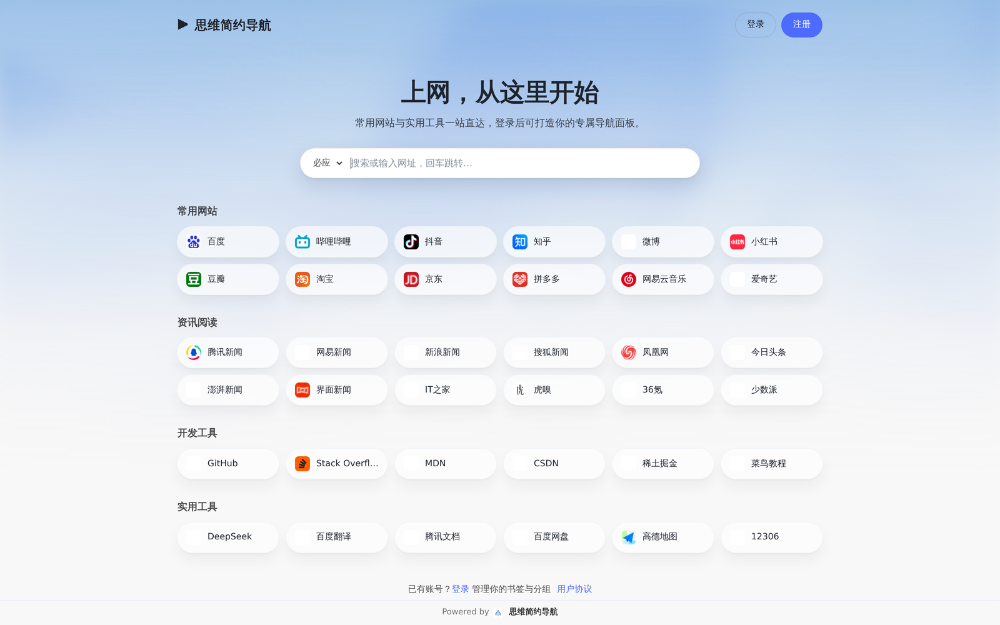
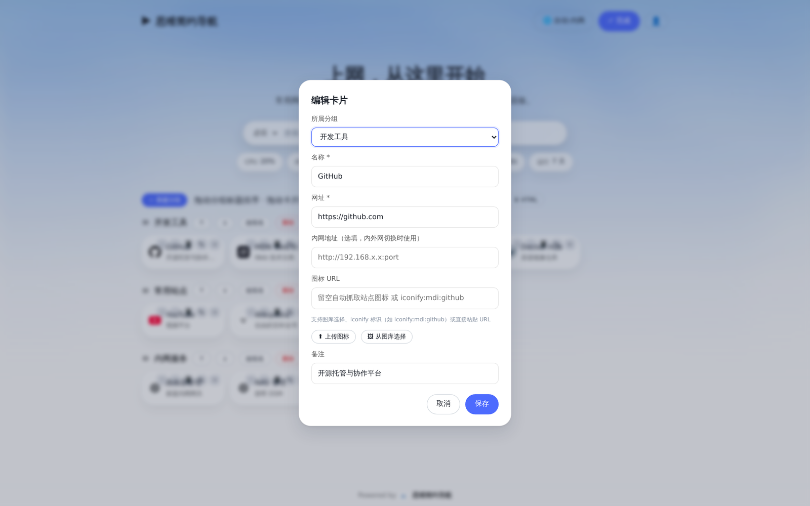
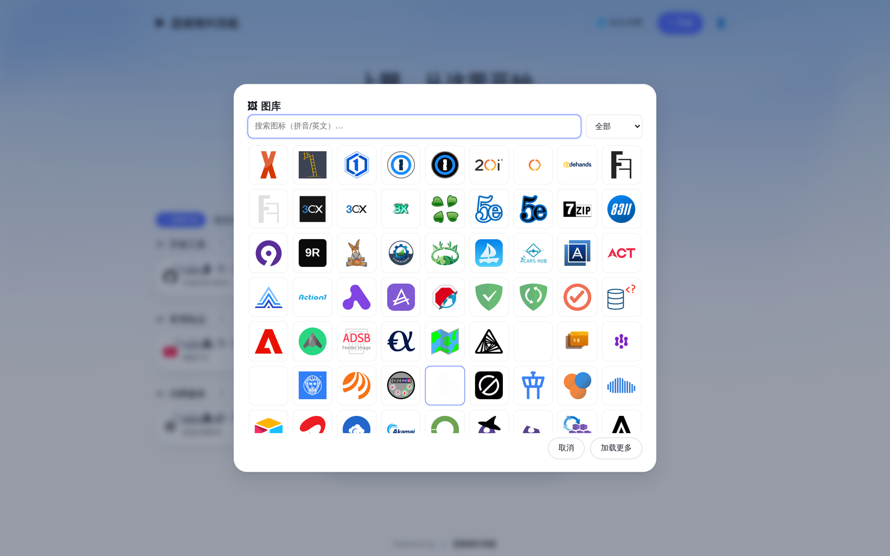
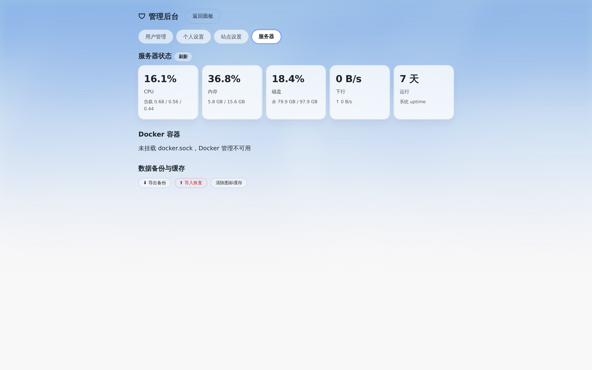
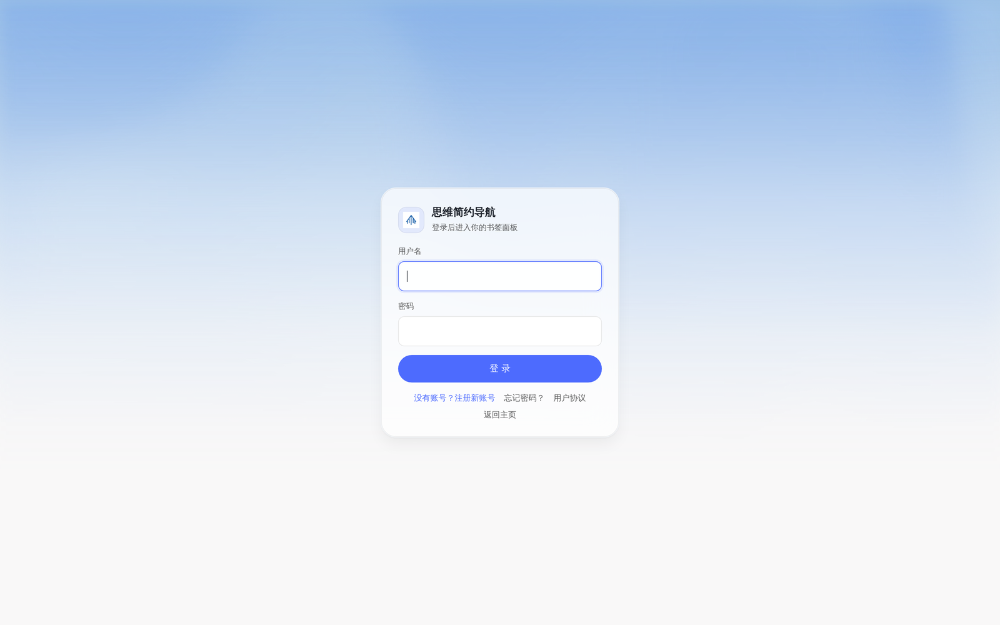
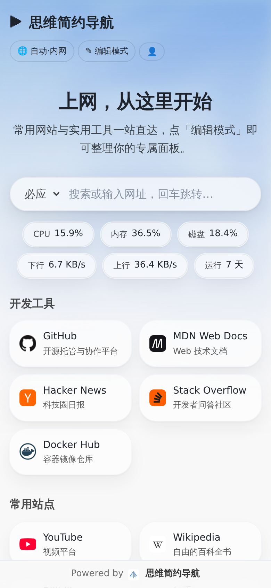

<div align="center">

# ITSWE-Nav 简约导航

**轻量级自托管导航页（起始页 / 书签面板），适合家庭与 NAS 小团队：分组卡片 · 内外网双地址切换 · 服务器监控 · Docker 管理**

单容器部署 · SQLite 存储 · 无外部数据库 · 零第三方 PHP/Composer 依赖（原生 PHP，无框架、无构建步骤）

[作者自用实例](https://nav.itswe.com) · [快速开始](#快速开始) · [完整文档](docs/) · [English](README.md) · [中文](README.zh.md) · [QQ 群](https://qm.qq.com/q/915072)




</div>

## 为什么做这个

市面上的导航页 / 起始页，要么功能过重，要么只服务单用户。「家庭与小型团队的自托管入口」是 ITSWE-Nav 的定位：**一个容器跑起来就能用**，SQLite 免装数据库，原生 PHP 零依赖；而「外网地址 + 内网地址」的双地址卡片与一键切换，专为「人在外网、NAS 在内网」的自托管场景设计。

## ✨ 功能

- **多用户**：首次访问自动创建内置管理员（admin / itswe，请立即改密）；注册用户均为普通用户（若管理员被全部删除，下一个注册者自动接管管理员以供恢复）；角色分级、建号、重置密码、禁用、删除；独立注册页（可选邮箱）、用户协议、邮箱验证码找回密码
- **分组与卡片**：无限分组、备注、桌面拖拽排序 / 跨组移动 / 键盘 ↑↓ 微调；移动端长按编辑
- **内外网切换**：每张卡片可配「外网 + 内网」双地址，顶栏 🌐 一键「自动 / 内网 / 外网」三模式**免刷新**切换；自动模式按站点内网网段（CIDR）判定客户端来源，反代环境自动读取 `X-Forwarded-For`
- **服务器监控**：CPU、内存、磁盘、上下行网速、负载、运行时长；面板状态条 30 秒轮询
- **Docker 管理**：容器列表、状态、端口映射、启动/停止/重启（可选挂载 `docker.sock`）
- **图标图库**：内置 [Dashboard Icons](https://github.com/homarr-labs/dashboard-icons)（4300+）与 [Simple Icons](https://github.com/simple-icons/simple-icons)（3400+）本地化图库，卡片编辑弹窗内搜索、筛选、一键选用
- **图标多级兜底**：自动抓取站点图标（服务端代理缓存）→ 本地上传 → 图库 → `iconify:` 标识 → 首字母
- **游客首页**：未登录可浏览推荐站点 + 搜索，中英双语两套推荐面板，含注册引导
- **双语界面**：中文 / English，默认跟随浏览器，可用 `?lang=en|zh` 强制指定
- **自定义外观**：6 款预设渐变壁纸、URL 壁纸、上传壁纸（≤8MB）；暗色模式跟随系统
- **数据自主**：整库备份导出/导入（JSON）、卡片导出 CSV / Netscape HTML、iframe 内嵌预览
- **安全**：CSRF 全覆盖、bcrypt 密码哈希、登录限速（用户名+IP）、上传 MIME 实测 + 随机文件名、增量自动迁移（升级不炸库、回滚兼容）

## 📸 截图

| 游客首页 | 编辑卡片 |
|---|---|
|  |  |

| 图标图库 | 服务器监控 |
|---|---|
|  |  |

| 登录页 | 移动端 |
|---|---|
|  |  |

## 🚀 快速开始

### 方式一：直接拉镜像（推荐）

```bash
mkdir itswe-nav && cd itswe-nav
curl -fsSLO https://raw.githubusercontent.com/showhoo/itswe-nav/main/docker-compose.yml
docker compose up -d
```

> compose 默认从源码构建；拉镜像部署请把 `docker-compose.yml` 里的 `build: .` 与 `image:` 行换成
> `image: ghcr.io/showhoo/itswe-nav:1.0.0`。

### 方式二：源码构建

```bash
git clone https://github.com/showhoo/itswe-nav.git
cd itswe-nav
docker compose up -d
```

打开 `http://localhost:8080`，默认管理员 **admin / itswe**，登录后请**立即修改密码**；注册**默认关闭**——需要其他成员注册时，由管理员在「管理后台 → 站点设置 → 开放注册」开启。

### 图标图库（可选，一步到位）

```bash
bash sync-gallery.sh            # 在 compose 所在目录执行；下载 7700+ 图标到 data/gallery/
```

不执行也能正常使用：自动 favicon、上传图标、iconify 标识均可用，只是「从图库选择」为空。

> ⚠️ 默认密码很弱，仅用于首次登录；公网部署务必立即改密、保持注册关闭（除非确实要开放），并置于反向代理之后。
> 不需要 Docker 管理功能？删掉 compose 里挂载 `docker.sock` 的那一行即可。

## 📖 文档

| 文档 | 内容 |
|---|---|
| [安装详解](docs/install.zh.md) | compose / 裸 docker / 非 root / 反向代理（nginx、Caddy）/ HTTPS |
| [配置参考](docs/config.zh.md) | 站点设置全项、环境变量、端口与数据卷 |
| [使用手册](docs/usage.zh.md) | 游客 / 成员 / 管理员三角色操作说明，移动端手势 |
| [常见问题](docs/faq.zh.md) | 默认密码、图库、内网判定、SMTP、备份恢复等 10 问 |
| [隐私说明](docs/privacy.zh.md) | 数据存放位置与全部外部请求清单 |

## ⚙️ 配置速览

| 项 | 说明 |
|---|---|
| 端口 | 默认 `8080`，compose 里改 `ports` |
| 数据 | 全部落 `./data`（SQLite 库 + 上传 + 图标缓存），**备份该目录 = 备份一切** |
| docker.sock | 挂载后启用 Docker 管理；不挂载不影响其他功能 |
| 界面语言 | 默认跟随浏览器；管理后台 → 站点设置可固定为中文 / English |
| 内网网段 | 默认 `192.168.0.0/16,10.0.0.0/8,172.16.0.0/12`，站点设置可改 |

## ⬆️ 升级与备份

```bash
git pull && docker compose up -d --build
```

- 结构变更由内置增量迁移在首次访问时自动完成，无需手工步骤；迁移只增不改，回滚旧版本代码亦兼容
- **备份**：SQLite 处于 WAL 模式，直接 cp 主文件可能得到不一致快照，推荐：
  - 管理后台 → 服务器 → **导出备份**（JSON 整库，含密码哈希，妥善保管）
  - 或 `docker compose stop` 后整体拷贝 `data/`

## ❓ 常见问题（节选）

<details>
<summary><b>登录后看不到监控 / Docker 功能？</b></summary>
管理后台 → 服务器（管理员可见）；面板状态条默认开启，站点设置里可关。Docker 管理需挂载 docker.sock。
</details>

<details>
<summary><b>内外网自动判定不对？</b></summary>
走反向代理时面板读 X-Forwarded-For 首个 IP，请确认反代正确传递该头；内网网段可在站点设置调整（CIDR，逗号分隔）。
</details>

<details>
<summary><b>注册收不到邮箱验证码？</b></summary>
邮箱验证码需先在站点设置配置 SMTP（支持 SSL/TLS/明文）；不配置 SMTP 时注册与找回密码照常可用，只是没有邮箱校验。
</details>

更多见 [docs/faq.md](docs/faq.zh.md)。

## 🔒 隐私

面板本体**不内嵌任何统计、上报或远程校验**。数据全部存在你自己的 `data/` 目录。唯一的外部请求与图标相关（favicon 抓取、图库同步），完整清单见 [docs/privacy.md](docs/privacy.zh.md)。

## ⭐ 署名与展示墙

ITSWE-Nav 完全免费、MIT 开源。页脚右侧的 **「Powered by + 图标」** 是这个项目唯一的推广方式——它安静地待在每个页面底部，默认链接指向 [www.itswe.com](https://www.itswe.com)。如果你觉得这个面板好用，保留这行小字就是对本项目最实在的支持，谢谢！

- 管理界面刻意**不提供**修改或关闭署名的开关；
- 如果确有需要（例如企业内网规范要求页面极简），技术上完全可以自行修改 `www/lib/credit.php` 与数据表种子——希望那是深思熟虑后的决定，而不是顺手一删；
- 署名被清空时，管理后台会显示一条**纯本地**的缺失提醒（无任何上报，也不影响功能）。

### 展示墙

保留页脚署名的站点，欢迎提交 PR 把你的导航站加进来（格式：`[站点名](链接)` — 一句话介绍）：

- [nav.itswe.com](https://nav.itswe.com) — 作者自用实例
- *（虚位以待，做下一个提交的人）*

## 💬 加入社区

扫码加入我们的 QQ 群——有任何问题、想法或想要参与贡献，都欢迎进来聊聊。

| QQ 群 |
|---|
| [915072](https://qm.qq.com/q/915072) |
|  |

## 🛠 参与贡献

欢迎 Issue 与 PR！开发环境与测试流程见 [CONTRIBUTING.zh.md](CONTRIBUTING.zh.md)。提交前请跑一遍 `bash run-tests-ci.sh`（覆盖 55 + e2e 148 + 迁移 8）。

## 🗺 路线图

- [ ] 微件卡片（时钟、系统信息小卡）
- [ ] 备份导入的按类恢复（仅书签 / 仅用户）
- [ ] 更多语言包

## 💝 支持项目

ITSWE-Nav 完全免费、MIT 开源，**不内嵌任何统计、上报或远程校验**。如果你觉得这个面板好用，欢迎下列方式支持——均为读者自愿赠与，金额随意、次数随意，不影响任何功能。

| 方式 | 说明 |
|---|---|
| [爱发电](https://afdian.com/a/showhoo) | 扫码或访问 afdian.com/a/showhoo，可选择档位或自填金额，支持微信与支付宝 |
| 微信赞赏 | 扫码打开赞赏入口，金额随意、次数随意；完全自愿，不影响访问 |

| 爱发电 | 微信赞赏 |
|---|---|
|  | [](https://www.itswe.com/images/4/47/Qr-support-3.png) |

> 提示：微信赞赏码点击可打开高清大图，长按或扫码更清晰。

## 📄 许可

[MIT](LICENSE) © showhoo

**致谢**：[创为](https://www.chuangwit.com) 赞助 VPS；图库来源 [Dashboard Icons](https://github.com/homarr-labs/dashboard-icons)（MIT）与 [Simple Icons](https://github.com/simple-icons/simple-icons)（CC0）；favicon 服务 [favicon.im](https://favicon.im)；旧浏览器 `<dialog>` 兼容层 [dialog-polyfill](https://github.com/GoogleChrome/dialog-polyfill)（MIT）。
</div>
